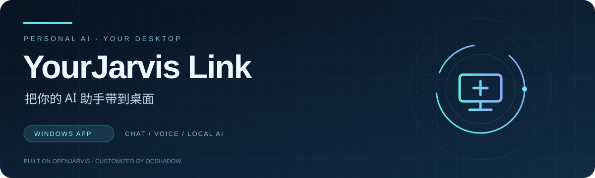

<div align="center">
  

  <h1>YourJarvis Link</h1>
  <p><strong>下载一个 EXE，开始使用你的桌面 AI 助手</strong></p>
  <p>中文安装向导 · 本地对话 · 可选语音 · 多渠道更新</p>
  <p>
    <a href="https://gitee.com/QcShadow/your-jarvis-link/releases">🇨🇳 Gitee 国内下载</a> ·
    <a href="https://github.com/QcShadow/YourJarvis-link/releases">GitHub 下载</a> ·
    <a href="#首次安装">安装步骤</a> ·
    <a href="#升级与修复">升级与修复</a>
  </p>
</div>

---

**YourJarvis Link** 是 YourJarvis 的 Windows 朋友版。通过中文图形向导安装运行环境、应用和所需模型，支持轻量本地模型、兼容 API 或 JARVIS 共享主机。

> **当前正式版：0.1.5** · 下载 **`JARVIS-Setup-0.1.5.exe`** 后直接双击。首次安装需要联网准备资源，完成后默认本地模型与已安装的本地语音可离线使用。

## 下载与版本

| 下载渠道 | 入口 | 说明 |
| :--- | :--- | :--- |
| **Gitee** | [国内发行版](https://gitee.com/QcShadow/your-jarvis-link/releases) | 国内网络优先选择 |
| **GitHub** | [GitHub Releases](https://github.com/QcShadow/YourJarvis-link/releases) | 同版本安装包与发行说明 |
| **版本说明** | [0.1.5 更新记录](https://github.com/QcShadow/YourJarvis-link/releases/tag/v0.1.5) | 一键更新、安装器视觉优化与开发能力开放 |

在发行版附件中选择安装 **EXE**。资源分块由安装器自动下载、合并与校验，无需手动解压或输入命令。

## 可以做什么

| 功能 | 说明 |
| :--- | :--- |
| **桌面聊天** | 中文优先的完整 JARVIS 界面，支持主题与角色配色 |
| **本地模型** | 默认使用 Qwen2.5 0.5B 与 CPU Ollama，适合先体验轻量文字对话 |
| **灵活连接** | 也可选择兼容 API，或使用主人提供的共享服务地址与邀请令牌 |
| **可选语音** | 安装向导提供中文男声／女声或英文方案，自动准备所选资源 |
| **本地状态** | 在自己的安装目录保存配置、聊天、记忆与模型 |
| **安装自检** | 检查真实模型连接、后端、页面与聊天；语音方案另有识别和合成检查 |

## 首次安装

1. **下载安装包** — 从上方渠道获取 `JARVIS-Setup-0.1.5.exe`，双击运行。
2. **选择位置与方案** — 使用默认位置或独立文件夹；首次体验建议选择「轻量本地模型 + 先使用文字」。
3. **等待安装与自检** — 向导自动准备依赖和模型，通过实际启动检查后才显示完成。
4. **开始对话** — 使用桌面快捷方式或安装目录内的 `JARVIS.exe` 启动。

支持 **Windows 10 22H2 / Windows 11 x64**。默认轻量模型适合短对话；较大的模型需要更多内存和相应硬件，可按电脑条件另行选择。

### 怎么选择使用方式？

| 方式 | 需要准备 | 适合的场景 |
| :--- | :--- | :--- |
| **轻量本地模型** | 首次联网下载默认模型 | 希望先在自己的电脑上开始使用 |
| **兼容 API** | 服务地址、模型与自己的 API 密钥 | 已有兼容服务，希望使用其模型 |
| **共享主机** | 主人提供的共享服务地址与邀请令牌 | 将推理交给提供服务的主机 |

使用 API 或共享主机时需要连接相应服务。共享模式请填写主人提供的 **共享网关地址**，而非私人助手页面或 Ollama API 地址。

## 升级与修复

**升级：** 从托盘退出应用，运行新版安装 EXE，选择原来的安装目录。向导保留配置、密钥、聊天、记忆、模型和日志，并清理旧 bootstrap 与独立语音下载入口。

**修复：** 安装失败时查看日志、调整方案并重试；启动失败页提供「修复安装」、重试和打开日志入口。当前版本直接使用安装 EXE 完成安装与修复。

## 常见问题

<details>
<summary><strong>需要手动安装 Python、Ollama 或 WebView2 吗？</strong></summary>

默认方案由安装器自动准备 Python、应用依赖、CPU Ollama、轻量模型和 WebView2 离线组件。选择语音时，还会准备相应识别与播报资源。

</details>

<details>
<summary><strong>下载中断或国内网络不稳定怎么办？</strong></summary>

资源下载优先使用 Gitee，失败自动切换 GitHub，支持断点续传，并检查文件大小与 SHA-256。查看日志后重试安装即可。自定义模型与第三方 API 由各自上游提供，不包含在默认资源镜像中。

</details>

<details>
<summary><strong>安装完成后还需要联网吗？</strong></summary>

默认本地模型和已安装的本地语音可离线使用。API、共享主机、更新检查和新增资源下载需要网络连接。

</details>

<details>
<summary><strong>为什么还有运行库和语音资源仓库？</strong></summary>

为便于分发较大的资源，Gitee 上的运行环境与语音资源分别保存在 [your-jarvis-runtime](https://gitee.com/QcShadow/your-jarvis-runtime) 和 [your-jarvis-speech](https://gitee.com/QcShadow/your-jarvis-speech)。安装器自动使用这些地址，普通用户只需下载主安装 EXE。

</details>

<details>
<summary><strong>如何手动校验 0.1.5 安装包？</strong></summary>

在安装包所在目录运行 PowerShell：

```powershell
Get-FileHash .\JARVIS-Setup-0.1.5.exe -Algorithm SHA256
```

0.1.5 正式 EXE 的 SHA-256：

`417f3c445d598d57c37bdefcba2e9ce17854cbdeaf8f6c99749e1ca0a30e48b4`

</details>

## 项目来源与许可

YourJarvis 是 QcShadow 基于 [OpenJarvis 官方项目](https://github.com/open-jarvis/OpenJarvis) 开发的个人定制分支，增加了中文优先的 Windows 桌面体验、语音、本地记忆、朋友共享和多渠道安装更新。本仓库用于发布朋友版成品；开发源码维护在 [YourJarvis-dev](https://github.com/QcShadow/YourJarvis-dev)。

本项目不是 OpenJarvis 官方发布。上游框架采用 [Apache License 2.0](https://github.com/QcShadow/YourJarvis-dev/blob/main/LICENSE)，发布包保留第三方组件的许可证与声明，并排除制作者的密钥、私人配置、聊天、记忆和浏览器数据。

朋友版 0.1.5 使用安装目录内的独立 Python、模型、配置和数据，后台与 Ollama 自动选择空闲端口，可与开发版并行运行。不要安装进开发目录；建议使用 `D:\YourJarvis-Test`。更新菜单现在可下载后直接重启应用更新。
